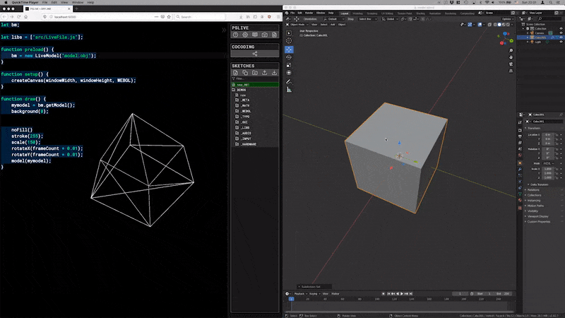

# Livereload 3D models in p5.js

LiveModel is a wrapper around p5's `loadModel()`. It brings livereload functionality to local p5.js projects automatically reloading a model (.obj or .mtl) file when it changes on your local filesystem.

I built this in order to be able to livereload models from Blender automatically in [P5LIVE](https://github.com/ffd8/P5LIVE). You can use this with any software, but I've found a way to get Blender to automatically export the whole scene as a `.obj` file when I save which makes it incredibly fast.



**Demo:** Every time the file is saved, it is automatically updated refreshed on the website.

**Current Limitations**

-   Only works for localhost websites. I haven't tested this but I assume you can't connect to any local websocket from any arbitrary website? Websockets have received a lot of flak recently so I'm not 100% on this and it might just work.
-   Does not work for co-coding on P5LIVE. It would only update the model for the person who is editing it not everyone else. It could be fun to try to propagate it through to everyone else using the cocoding socket connection.

## Installation for local P5LIVE

1. Setup a local instance of P5LIVE. [Instructions here](https://github.com/ffd8/P5LIVE#offline-server).
    1. It does not matter if you do the python or node version here but you will need `node` and `npm` for the LiveModel server so might it's easier to use that for both.
1. Copy `LiveModel-Server.js` to your P5LIVE folder.
1. Create a `models` folder and store your `.obj` files there.
1. Install the `ws` npm package into the p5live project: `npm i ws`
1. Run the nodejs server `node LiveModel-Server.js`
1. The `models` directory is now being watched and clients can connect to the node server to request updates for a specific file.

## Installation of Blender Add-on

1. Download `Blender-Export-To-OBJ-Addon.py`
1. Modify the `targetDir` variable to point to your `models` directory inside your p5live project.
1. Install the plugin on Blender
    1. Blender Preferences -> Add-ons -> Install.. and select the file
1. Every time you save the file now it should create an .obj file with the same filename in the `models` directory. `mymodel.blender` results in `mymodel.obj`

## Usage with P5LIVE

```javascript
let myLiveModel; // Create a globally scoped variable

var libs = ["LiveModel.js"];

function preload() {
    // Create a new instance of LiveModel with the filename
    myLiveModel = new LiveModel("model.obj");
}

function draw() {
    // Always get the latest model from the LiveModel instance
    const myModel = myLiveModel.getModel();
    // ...

    // Use as you would a regular p5.Model
    model(myModel);
}
```

## Contribute

Any feedback, comments, feature or pull requests always welcome.
